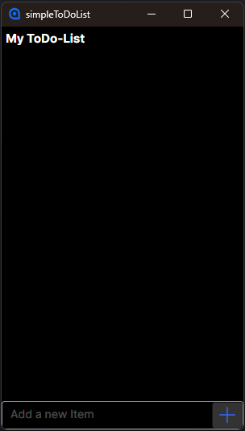
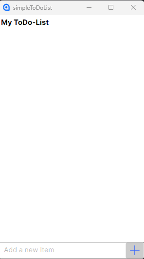

A simple, cross-platform To-Do List application built with .NET 8 and Avalonia UI featuring automatic JSON persistence to `%APPDATA%\ToDoList`.

## 📋 Features

- ✅ Add, edit, and delete tasks
- ✅ Mark tasks as completed (with persistent state)
- ✅ Automatic JSON saving to local AppData folder
- ✅ Cross-platform: Windows, macOS, Linux
- ✅ MVVM architecture with CommunityToolkit.Mvvm
- ✅ Responsive design

### Prerequisites

- [.NET 8 SDK](https://dotnet.microsoft.com/download/dotnet/8.0) or later
- Git (optional, for cloning)

### Installation

1. **Clone the repository:**
   ```bash
   git clone https://github.com/yourusername/simpleToDoList.git
   cd simpleToDoList
   ```

2. **Restore dependencies:**
   ```bash
   dotnet restore
   ```

3. **Build the project:**
   ```bash
   dotnet build
   ```

### Running the Application

```bash
dotnet run --project simpleToDoList
```

The application will launch and display the main window. Tasks are automatically saved to `%APPDATA%\ToDoList\todoitems.json` on your local machine.

## 📖 Usage

### Managing Tasks

- **Add a task**: Type in the input field at the top and press Enter or click the "+" button
- **Edit a task**: Double-click on a task item to edit its text directly
- **Delete a task**: Click the trash icon (or press Delete key) on a task item
- **Mark as completed**: Click the checkbox next to a task to toggle its completion state
- **Persistent state**: All task data (including completion status) is automatically saved to JSON

### Data Storage

Tasks are stored in:
- **Windows**: `%APPDATA%\ToDoList\todoitems.json`
- **macOS**: `$HOME/Library/Application Support/ToDoList/todoitems.json`
- **Linux**: `$XDG_DATA_HOME/ToDoList/todoitems.json` or `$HOME/.local/share/ToDoList/todoitems.json`

The JSON file contains an array of task objects with `Content` (string) and `IsChecked` (boolean) properties.

## 📂 Project Structure

```
simpleToDoList/
├── .github/                  # GitHub-specific files (ISSUE_TEMPLATE, PULL_REQUEST_TEMPLATE)
├── Assets/                   # Application icons and resources
├── Views/                    # XAML views (UI)
│   └── MainWindow.axaml      # Main window layout
├── ViewModels/               # MVVM view models
│   ├── MainWindowViewModel.cs    # Main window logic & commands
│   ├── ToDoItemViewModel.cs      # Individual task view model
│   └── ViewModelBase.cs          # Base view model with INotifyPropertyChanged
├── Models/                   # Data models
│   └── ToDoItem.cs           # Simple task model
├── Services/                 # Application services
│   └── JsonStorageService.cs     # Handles JSON persistence to AppData
├── App.axaml.cs              # Application entry point
├── Program.cs                # Standard .NET entry point
├── simpleToDoList.csproj     # Project file
├── README.md
├── LICENSE.txt
├── .gitignore
└── .gitattributes
```


### Development Setup

1. Install [.NET 8 SDK](https://dotnet.microsoft.com/download/dotnet/8.0)
2. Clone the repository: `git clone https://github.com/yourusername/simpleToDoList.git`
3. Open in your preferred IDE (Visual Studio, Rider, or VS Code with C# extension)
4. Build and run: `dotnet run --project simpleToDoList`


## 📸 Screenshots




## 📄 License

This project is licensed under the **MIT License** - see the [LICENSE.txt](LICENSE.txt) file for details.

**TL;DR**: You can do whatever you want with this code as long as you include the original copyright and license notice in any copy of the software/source.


⭐ **If you found this project helpful, please consider giving it a star on GitHub!** 
